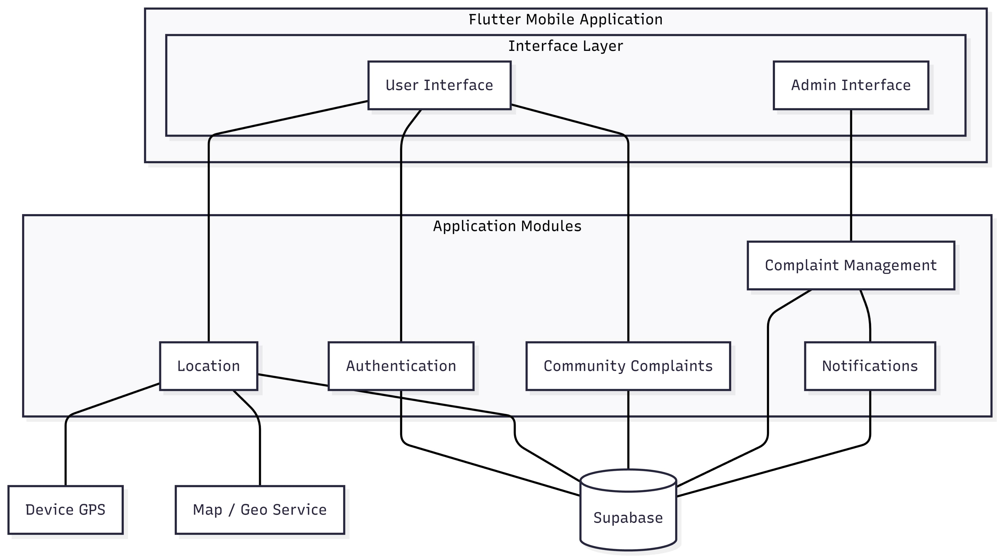
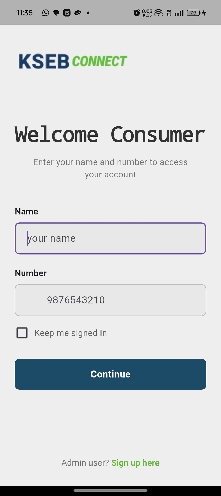

  

<!-- <h1 align="center">⚡ KSEB Connect</h1> -->

  A Smart Complaint Management System for Electricity Services

  
  
  
  

---

## 📌 Overview

**KSEB Connect** is a mobile-based complaint management system designed to improve the way electricity-related issues are reported, tracked, and resolved.

It bridges the gap between **consumers and electricity authorities** by introducing a **location-based, transparent, and community-driven system**.

---

## 🚀 Features

### 👤 User Features
- Report electricity issues (power failure, line damage, transformer faults, etc.)
- Attach images for better clarity
- Auto-detect location using GPS
- automatically assigns complaint to the nearest section office
- View nearby complaints on map
- Upvote complaints to highlight critical issues
- Track complaint status in real-time

### 🛠 Admin Features
- Map-based complaint monitoring dashboard
- View and prioritize complaints
- Update complaint status (Pending → In Progress → Resolved)
- Reassign complaints to different section offices
- Send alerts and announcements to users

---

## ⚙️ How It Works

1. User logs into the application  
2. Reports a complaint with:
   - Location (GPS-based)
   - Description
   - Optional image  
3. System:
   - Stores complaint in database  
   - Assigns it to nearest section office  
4. Nearby users:
   - Can view and upvote complaints  
5. Admin:
   - Monitors complaints via dashboard  
   - Updates status  
6. User receives real-time notifications  

---

## 🧩 System Architecture Diagram

  

---

## 🏗 Modules

- **User Module** – Registration, login, complaint reporting  
- **Location Module** – GPS detection & mapping  
- **Community Module** – Nearby complaints & upvotes  
- **Admin Module** – Complaint management dashboard  
- **Notification Module** – Real-time updates  

---

## 🛠 Tech Stack

| Category        | Technology Used        |
|----------------|----------------------|
| Mobile App     | Flutter (Dart)       |
| Backend        | Supabase             |
| Database       | PostgreSQL           |
| Maps           | OpenStreetMap / APIs |
| Tools          | Android Studio, VS Code |

---

## 📲 Download APK

👉 **Try the App:**  
[Download APK](https://github.com/code-with-me-an/kseb-connect-flutter/releases/download/V1.1.1/app-release.apk)

---

## 📸 Screenshots

---

## 🔐 Non-Functional Highlights

- Fast response time (few seconds)
- Secure authentication system
- Scalable backend architecture
- User-friendly UI/UX
- Reliable performance under load

---

## 🎯 Problem Solved

Traditional systems:
- ❌ Slow complaint handling  
- ❌ No transparency  
- ❌ No prioritization  

KSEB Connect:
- ✅ Location-based reporting  
- ✅ User-driven prioritization  
- ✅ Real-time tracking  
- ✅ Better communication  

---

## 👨‍💻 Team

- Abhiram R  
- Adithyan N  
- Ananthu T P  
- Anjana M M  

---

## 📄 License

This project is developed as a **mini project** for academic purposes only and is not affiliated with or endorsed by Kerala State Electricity Board (KSEB).

---

## 📬 Contact

For queries or collaboration:  
📧 *(code.with.me.an@gmail.com)*

---

⭐ If you like this project, give it a star!